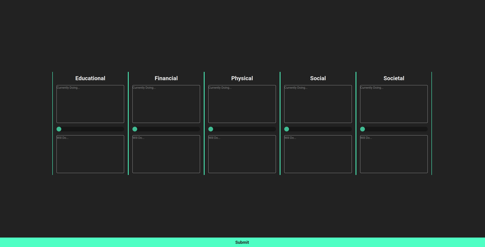

# Life Evaluation

## What is this?

Every month I evaluate my life and try to improve it, I do this based on 5 metrics:

- Educational
- Financial
- Physical
- Social
- Societal

I examine what I have been doing to improve these aspects of my life, give myself a score out of 5, then describe what I will do to improve each area in the coming month.

I have noticed interesting trends and since I do this often, I thought I should spend 2 hours making a site, linked to firebase to store my data and streamline the process.

The link is not public for obvious reasons, but if you think this evaluation style will help you, feel free to fork this repo and make your own site.

This is designed to be small and minimalistic, so it is easy to use and doesn't take up too much time. Additionally it is designed to be broad to evaluate my life at any point.



## Built with

- [Vue](https://vuejs.org/)
- [Firebase](https://firebase.google.com/)
- [Netlify](https://www.netlify.com/)
- [Cloudflare](https://www.cloudflare.com/)

## Project Setup

### Prerequisites

1. create a firebase project with a fireStore database
2. Copy the firebase config and paste it in `src/components/firebase.ts`
3. This is required for the site to store any data

### Install Dependencies

```sh
npm install
```

### Run

```sh
npm run dev
```

### Production Build

```sh
npm run build
```

### Lint with [ESLint](https://eslint.org/)

```sh
npm run lint
```
